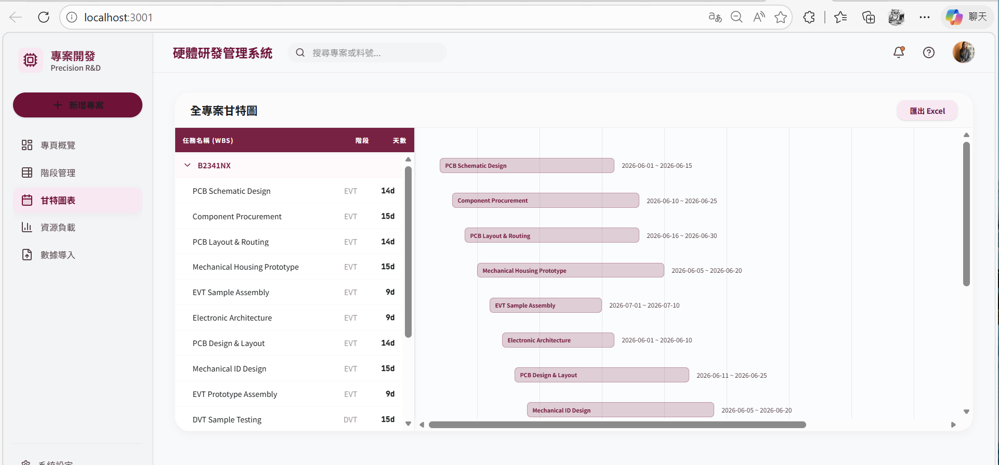

# 科技業硬體研發專案管理系統 (Precision R&D Management)



這是一個專為科技業硬體研發設計的輕量化專案管理系統 (MVP)，採用 **FastAPI + React** 全端架構，旨在取代傳統難以維護的 Excel 管理模式，解決硬體開發中時程連動複雜與資源分配混亂的痛點。

## 🌟 核心功能

*   **結構化 Stage-Gate 流程**：遵循 NPI (EVT/DVT/PVT) 標準研發流程。
*   **互動式甘特圖**：即時編輯任務，自動計算關鍵路徑與日期連動。
*   **資源衝突預警**：主動偵測工程師與設備的負載狀態，即時標示跨專案衝突。
*   **時程 (WBS) 智慧匯入/匯出**：支援 Excel 批次處理，大幅降低資料輸入成本。
*   **安全性強化**：具備路徑遍歷防護、CORS 限制與詳細的日誌監控。

## 🏗️ 技術架構

*   **前端**：React 19, TypeScript, Vite, Tailwind CSS, Lucide React, Framer Motion.
*   **後端**：Python 3.11+, FastAPI, SQLAlchemy ORM.
*   **資料庫**：SQLite (單一檔案資料庫，無需安裝).
*   **資料處理**：Pandas, Openpyxl.

## 🚀 快速啟動

### 後端啟動 (FastAPI)
1. 進入 `backend` 目錄。
2. 建立並啟動虛擬環境：
   ```cmd
   python -m venv venv
   venv\Scripts\activate
   ```
3. 安裝依賴：`pip install -r requirements.txt`
4. 啟動伺服器：`uvicorn main:app --reload` (運行於 http://127.0.0.1:8000)

### 前端啟動 (React)
1. 進入 `precision-rd-management` 目錄。
2. 安裝套件：`npm install`
3. 啟動開發伺服器：`npm run dev` (運行於 http://localhost:3001)

## 📂 專案結構

```text
.
├── backend/                # FastAPI 後端應用程式
├── precision-rd-management/ # Vite + React 前端應用程式
├── Project_WBS_Final.xlsx  # 測試用 WBS 匯入範本
├── seed_data.py            # 資料庫填充腳本
└── simulate_conflicts.py   # 資源衝突模擬腳本
```

## 📄 授權

本專案僅供研發管理與技術展示使用。
